# Ejercicio-cluster-fstab
## Creación del cluster con dos nodos
Lo que hacemos en crear la máquina virtual sin disco duro ya que usaremos un iso con el que arrancaremos el SO live. El siguiente paso es iniciar los nodos, para ello lo que haremos será crear dos máquinas virtuales las cuales arrancarán desde la tarjeta de red, por lo que tampoco les hace falta disco duro. Nos tenemos que asegurar que tanto los nodos como la maquina principal están en la misma red. Si todo los anterior es correcto una vez iniciados los nodos se configuran automáticamente y se enlazan al cluster.

## Creación de trabajos con cron
Lo que hacemos es editar con nano el /etc/crontab y escribimos lo siquiente:
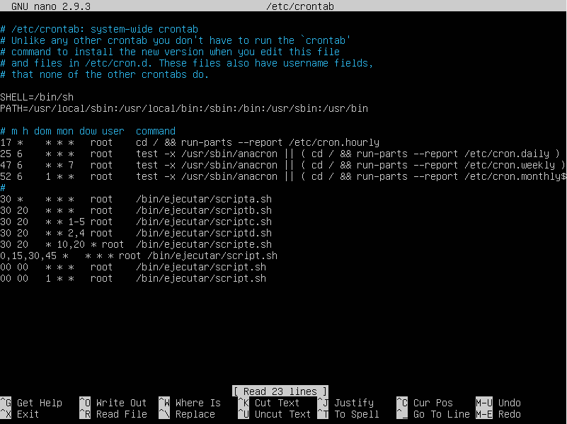

## Creación de particiones con fdisk
Lo primero que tenemos que hacer es instalar fdisk. Una vez instalado tenemos que ver como se llaman los discos sin formato que ceremos particionar, en mi caso son los doss últimos de la siguiente imagen.
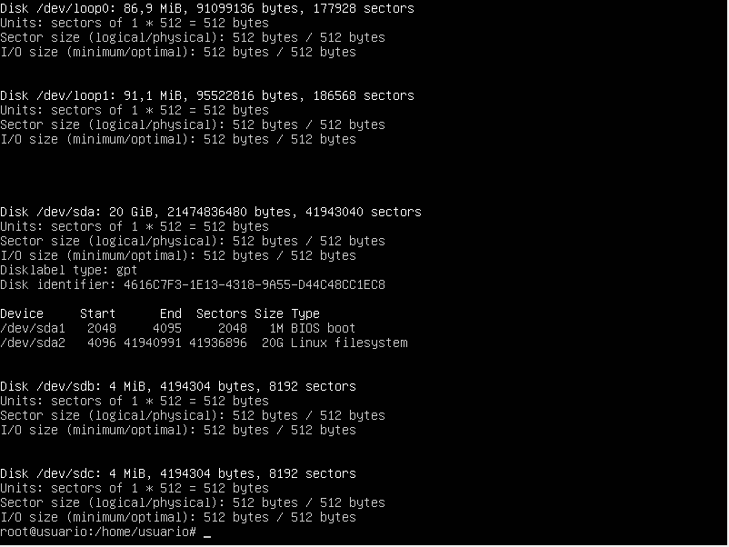

Con el comando fdisk y el disco duro entramos las herramientas de fdisk y lo que hacemos en la siguiente imagen es crear una nueva tabla de particiones con 'o', seguido de la creación de la primera particion con 'p' y despues se le ponen los parametros necesarios para crear la partición.
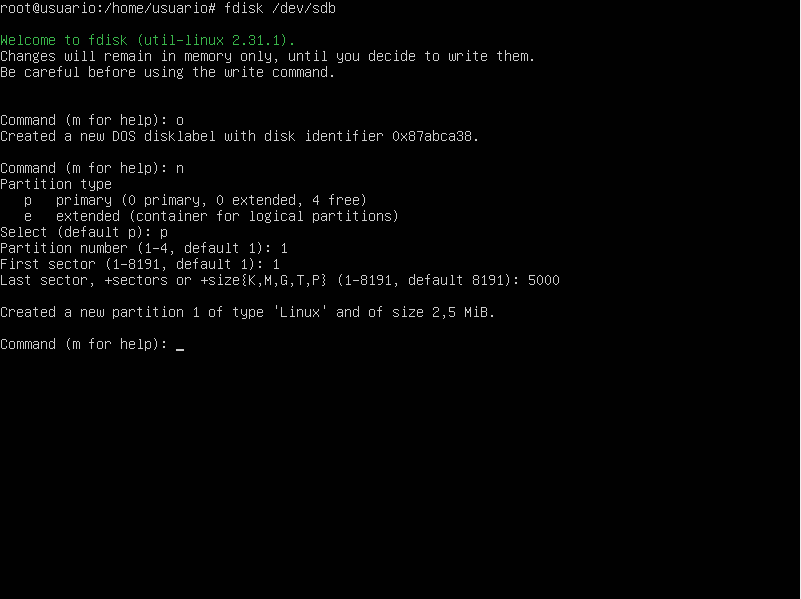

Con la segunda particion hacemos lo mismo solo que al final con el parametro 't' lo que hacemos es especificarle en tipo de almacenamiento.
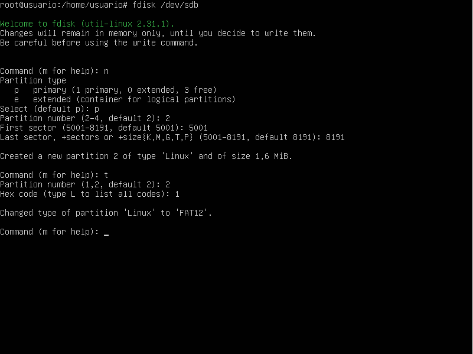

Y como vemos en la siguiente imagen se han creado las dos particiones.
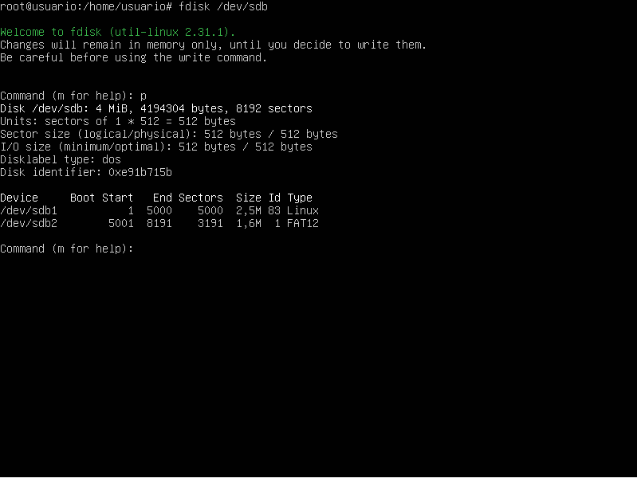

Hacemos los mismo con las tres particiones del segundo disco y observamos el resultado.
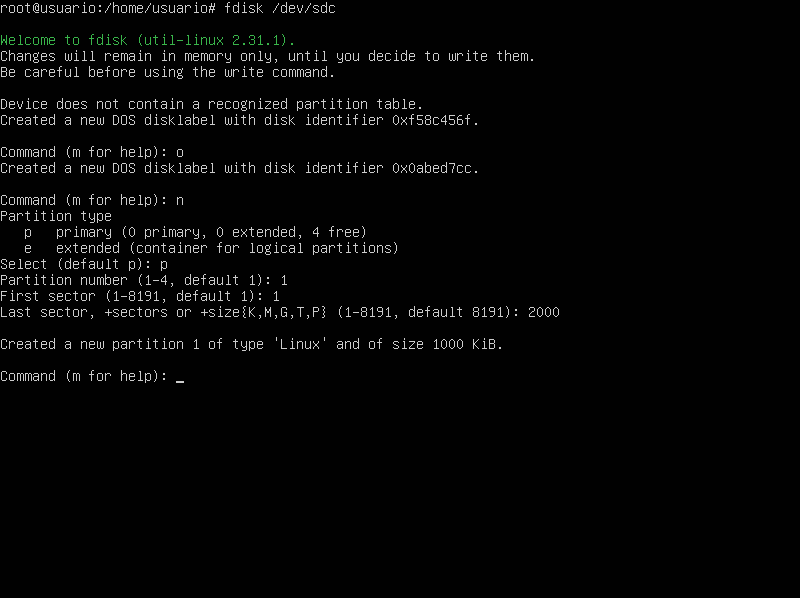
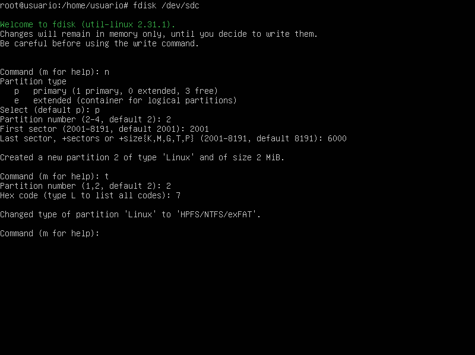
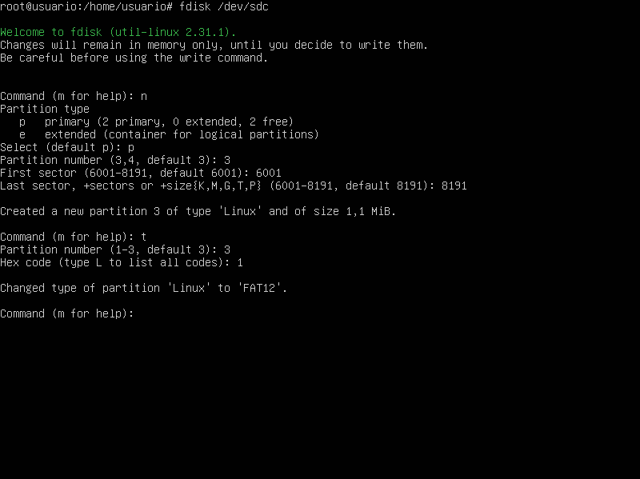
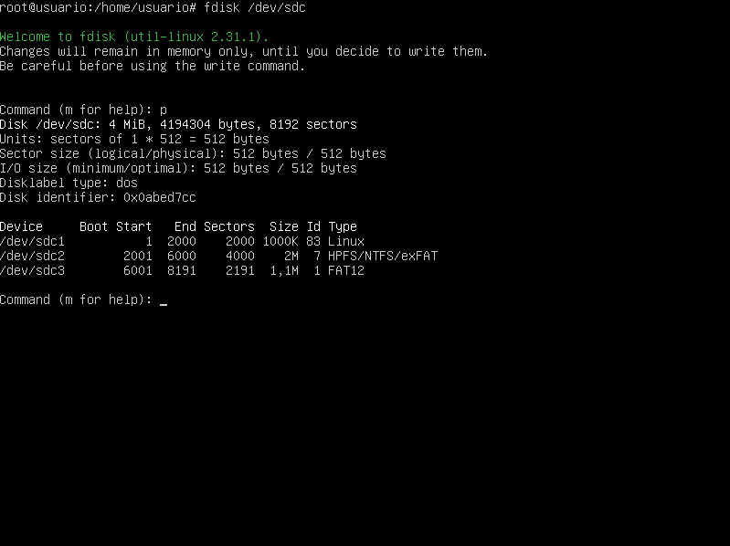

Para poder configurar que las tres particiones del segundo disco se monten automáticamente cuando se inicia el SO lo que tenemos que hacer es ver los UUID de las particiones y para eso las tenemos que montar manualmente primero y luego la podremos ver como se muestra en la imagen:
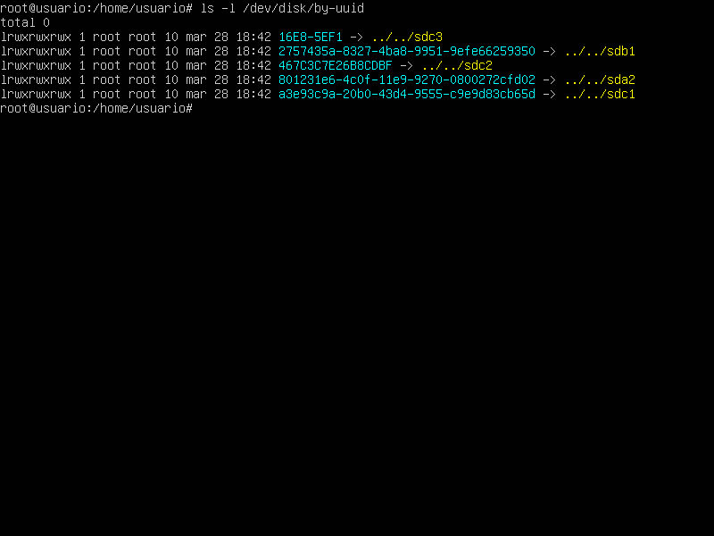

Despues de obtener la información lo que tenemos que hacer es configurar el fstab con la uuid de la partición, además de la ruta donde se van a montar las particiones y algunos parámetros más como vemos a continuación:
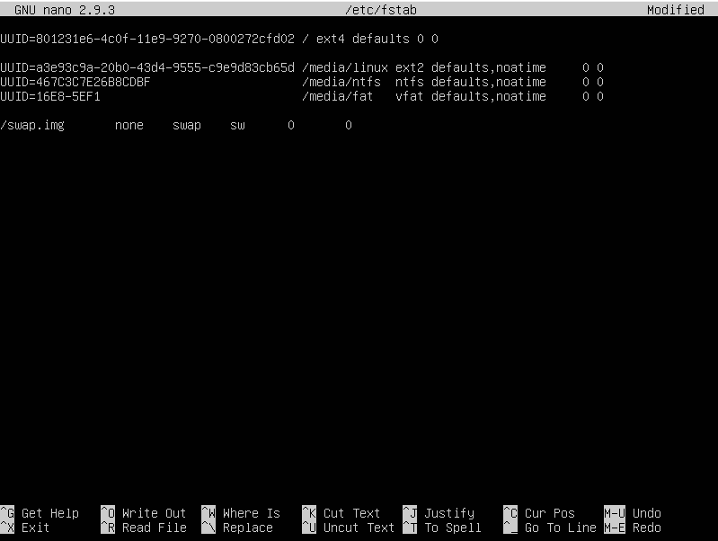

Después reiniciamos la máquina virtual y veremos que las particiones que hemos configurado se montan automáticamente al iniciarse el sistema.
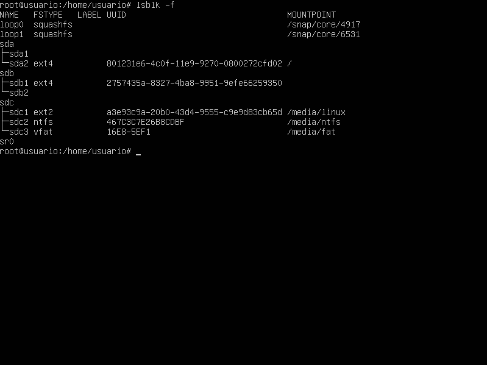
